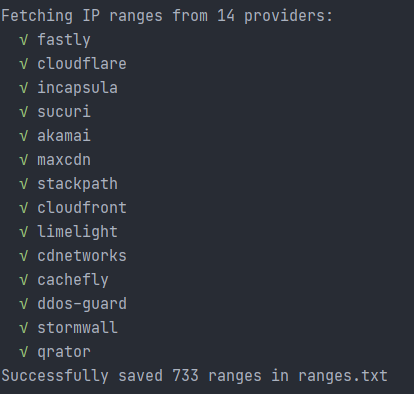

# CDN Ranges
Tool to download a list of IP ranges used by CDNs (Cloudflare, Akamai, Incapsula, Fastly, etc). This helps to avoid performing unnecessary port scans when doing bug bounties.

This uses publicly available lists of IP ranges, provided by most providers, and [BGPView](https://bgpview.io/) to query IP ranges for ASNs.

This was heavily inspired by [Project Discovery's cdncheck](https://github.com/projectdiscovery/cdncheck).

## CDN Providers
Provider | ASN or Public List
--- | ---
Akamai | AS12222, AS16625
CacheFly |  https://cachefly.cachefly.net/ips/rproxy.txt
CDNetworks | AS36408
Cloudflare | https://www.cloudflare.com/ips-v4
CloudFront | https://ip-ranges.amazonaws.com/ip-ranges.json
DDoS Guard | AS57724
Fastly | https://api.fastly.com/public-ip-list
Incapsula | https://my.incapsula.com/api/integration/v1/ips
MaxCDN | https://support.maxcdn.com/hc/en-us/article_attachments/360051920551/maxcdn_ips.txt
Qrator | AS200449
StackPath | AS12989
StormWall | AS59796
Sucuri | AS30148
X4B | AS136165


If a provider is missing, please open an issue with a link to their IP ranges or ASN



## Usage
Download ip ranges for all providers
```
node download --output ranges.txt
```

Download for a specific provider (lowercase and replace spaces with -)
```
node download --provider cloudflare
```

Dump in json format
```
node download --format json --output ranges.json
```

Dump in csv format (format: provider,range)
```
node download --format csv --output ranges.csv
```

## Support Formats
* txt (default)
* json
* csv
